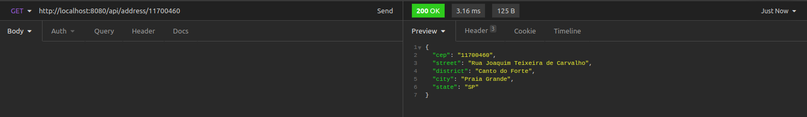

<div style="background-color: #000; border-radius: 10px; padding: 15px; opacity: 0.9">
<p align="center">
  <h3 align="center">&#129309; MOTOR DE BUSCA DE INFORMAÇÕES DE ENDEREÇOS POR CEP </h3>

  <p align="justify">
    API de desafio que constitui em:<br>
    <ul>
    <li>Serviço exposto de BUSCA DE CEP.</li>
    <li>Possibilitar ao cliente obter o nome da RUA, BAIRRO, CIDADE e ESTADO para preencher seus dados de cadastro de forma automática. </li>
    <ul>
  </p>
</p>
</div>


<!-- TABLE OF CONTENTS -->
<details open="open">
  <summary><h2 style="display: inline-block">Sumário</h2></summary>
  <ol>
    <li><a href="#tech">Tecnologias Utilizadas</a></li>
   <li><a href="#design-patterns">Padrões e boas práticas adotadas</a></li>
    <li>
      <a href="#getting-started">Getting Started</a>design-pattern
      <ul>
        <li><a href="#docker-installation">Instalação com Docker</a></li>
        <li><a href="#prerequisites">Pre-requisitos</a></li>
        <li><a href="#installation">Instalação Manual</a></li>
        <li><a href="#tests">Testes Automatizados/ Testes Unitários</a></li>
        <li><a href="#swagger">Insomnia</a></li>
        <li><a href="#contact">Contato</a></li>
      </ul>
    </li>
  </ol>
</details>


<div id="tech"></div>

## ⚙️ Tecnologias Utilizadas

* [Java 11](https://www.devmedia.com.br/as-boas-partes-do-java-11/40193)
* [Gradle 5](https://gradle.org/whats-new/gradle-5/)
* [Spring](https://spring.io/)
* [MongoDB](https://www.mongodb.com/)
* [ViaCEP Webservice](https://viacep.com.br/)


<div id="design-pattern"></div>

## Padrões e boas práticas adotadas

Essse projeto foi desenvolvido seguindo o padrão de MVC, organizado em (CONTROLLERS, SERVICES, RESPOSITORIES E MODELS). Esse padrão é muito conhecido pelo mercado e acredito 
que se encaixe perfeitamente em aplicações e microserviços que não possuem grande tendência a crescer.
Optei por eesse padrão porque acredito que soluções populares e simples garantem a organização do seu projeto
e que todos da equipe irão entender e conseguir dar manutenção. Soluções complexas que poucos entendem, 
depois de um tempo tendem a adotar algum antipattern ou perder sua organização, causando bugs. Então sempre fujo de matar baratas com canhões desnecessáriamente.

* DTOs são objetos compartilhados com o exterior, utilizei esses para definir a tipagem do que é externo
* O controller no caso da utilização do framework spring atua como exposição de rotas e pequenas validaçẽos. Recebe como injeção de dependência seus respectivos services. O controller aciona o service para processamento da regra de negócio.
* O service é o responsável por tratar as regras de negócio e como elas devem ser implementadas (Ex: o horário de agendamento de um cliente não deve conflitar com o horário de outro cliente). 
  Recebe como injeção de dependência seus respectivos repositories. O service aciona as funções do repository para persistência de dados.
* O repository é o responsável por se comunicar com a model e implementar métodos para manipulação dos dados do banco de dados.


<div id="getting-started"></div>

## Getting Started

Para instalar na sua máquina e rodar a aplicação siga os passos abaixo


<div id="docker-installation"></div>

### 🐋 Instalação e uso com Docker

1. (No terminal) Clone o repositório
   ```sh
   git clone https://github.com/RodrigoTopan/cepsearcher-challenge
   ```

2. (No terminal) Vá até a pasta do projeto e execute
   ```sh
   docker-compose up
   ```

4. Aguarde um pouco e pronto! O projeto está rodando por padrão em http://localhost:8080

5. Para buscar seu endereço, utilize a requisição abaixo trocando ${seuCEP} pelo número do seu CEP.
   Pode importá-la no seu INSOMNIA, POSTMAN ou realizar a requisição chamando a url por qualquer browser.
    ```sh
     curl --request GET --url http://localhost:8080/api/address/${seuCEP}
     ```

6. Se preferir, também disponibilizei na pasta "raiz" do projeto, o arquivo dump do Insomnia para você poder importá-lo na sua máquina

<div id="prerequisites"></div>

### 🛠️ Pré-requisitos (Instalação Manual)

* Instalar o Java 11 (Se você usa linux: sudo apt-get install openjdk-11-jdk)

* Gradle 5 ou mais recente

* Possuir um servidor mongodb rodando localmente, por padrão o projeto irá se conectar em localhost:27017 (pode ser alterado no arquivo, application.yml)

<div id="installation"></div>

### 🚀 Instalação Manual e Rodando o Projeto

1. Clone o repositório
   ```sh
   git clone https://github.com/RodrigoTopan/cepsearcher-challenge
   ```
3. Verifique se o arquivo .env está apontando corretamente para o MONGO ou redis da sua máquina

4. Executar o projeto
   ```sh
   ./gradlew bootRun
   ```

5. O projeto por padrão vai rodar na PORTA 8080

6. Exemplo de busca
   


7. Se preferir, também disponibilizei na pasta "raiz" do projeto, o arquivo dump do Insomnia com as requisições para você poder importá-lo na sua máquina


<div id="tests"></div>

### &#9989; Testes de integração


Para executar os testes automatizados, execute o comando abaixo.
   ```sh
   ./gradlew test
   ```

<div id="contact"></div>

Observação:
Para atender as regras de negócio definidas no desafio, disponibilizei a branch master.
Como proposta para uma consulta mais eficiente, disponbilize a branch "feat/improvedPerformance".

## 🧑‍💼 Contato

Rodrigo Garcia Topan Moreira - [@linkedin](https://www.linkedin.com/in/rodrigotopan)

Email: rodrigo.topan.ti@gmail.com
